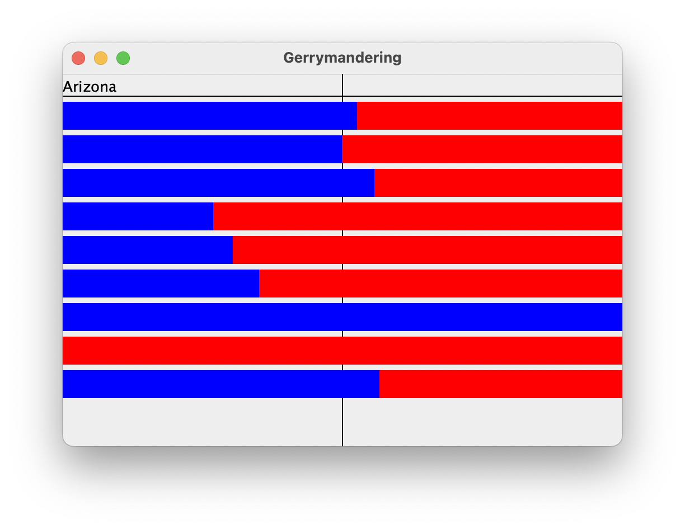

Unit 3: Conditions and Iterations
============

*Standard 4 - Understand condition and iteration structures and apply to programs*

## Gerrymandering Lab

_Adapted from “Gerrymandering” by Allison Obourn, University of Arizona_


## Introduction

The goal of this lab is to apply your understanding of decision and loop structures to implement an algorithm to provide insight into an authentic societal issue (gerrymandering).

Gerrymandering is creating voting districts in such a way that gives one party an unfair advantage over the other. Political parties do this to try to help themselves stay in power. Recently, a research group came up with a mathematical definition for what constitutes gerrymandering. For this project, you will prompt the user for a state name, and then determine whether the state’s districts are gerrymandered, according to the researchers’ definition, and output a graphical representation of the districts. The input data about states’ districts and total voters comes from two input files provided in your GitHub repository. Even if you disagree with this definition of gerrymandering, it is interesting to understand it better as the courts are currently debating it.

Your program should give an introduction and then prompt the user for a state name. It should then read the district file searching for that state, case-insensitively (that is, you should find the state regardless of the capitalization the user uses when typing it in). If the state is found in the file, your program should print the total wasted votes of democrats, the total wasted votes of republicans, the total voters in the state, who has gained an advantage from gerrymandering the state (if it is gerrymandered), and display information about the state graphically.


## Sample Output


```
This program allows you to search through
data about congressional voting districts
and determine whether a particular state is
gerrymandered.

Which state do you want to look up? Arizona
Total Wasted Democratic votes: 327852
Total Wasted Republican votes: 369697
4738332 eligible voters
```





## Input Data and Files

Your program reads data from two files, which are in your GitHub repository.


### districts.txt: congressional district data

Each line of districts.txt contains a state name followed by district information in groups of three. The first of the three is the district name, the second the democratic votes in that district and the third the republican votes in that district. Depending on the size of the state, there will be a different number of districts. For example:


```
Arkansas,1,63555,124139,2,103477,123073,3,0,151630,4,87742,110789
Alaska,1,114596,142566
Rhode Island,1,87060,58877,2,105716,63844
```


Notice that the data is separated with commas (“,”). The code that is provided for you configures the `Scanner` object to treat commas and newlines as delimiters. The vote counts will always be

integers.

After the user types a state name, search each line of districts.txt to see if it contains data for that state. If the state name is found, output its data line to the console, then construct a DrawingPanel to graph the data (see next page). Your code should not assume that the file is sorted alphabetically.

If the state name is not found, output a "not found" message and don’t show any data. No DrawingPanel should appear.


```
This program allows you to search through
data about congressional voting districts
and determine whether a particular state is
gerrymandered.

Which state do you want to look up? mErLin
"mErLin" not found.
```


The data displayed above has a different number of districts for each state. Your program should work properly with any number of districts of data greater than 0. Since there is a limit to the size of the DrawingPanel, you may not be able to see all decades worth of data at the default height, but your code should process as many districts of data as it finds in the line.


### eligible_voters.txt: the number of eligible voters in each state

If the state name is found in `districts.txt`, you should also read `eligible_voters.txt` to find its total number of eligible voters. The number of eligible voters should be printed to the console and also drawn on the DrawingPanel. Every state name in `districts.txt` is also in `eligible_voters.txt`, so you do not need to worry about a state having district data but no eligible voter data.

Each line of `eligible_voters.txt` contains a state name, followed by the eligible voter count for that state. For example:


```
Alabama,3606103
Alaska,519501
Arizona,4738332
Arkansas,2148441
California,25278803
```


Though the two input files contain different data, the task of searching for a state name in `districts.txt` is very similar to the task of searching for a state name in `eligible_voters.txt`. Your code should take advantage of this fact and should avoid redundancy. You should write your code in such a way that you stop searching a file once you find a line that has the name you’re searching for.

You may not assume the input files will have 50 lines. Your program must work on any length input file.          


## Determining Gerrymandering

You can determine gerrymandering for states with three or more districts by counting up and comparing the wasted votes cast for each party. We will define a wasted vote as any vote not needed to win the election. That means all votes for the party that loses the district seat are wasted as well as all votes for the winning party other than the half + 1 they need to win the majority.

For example, imagine that there was a state with the following districts:


<table>
  <tr>
   <td>
   </td>
   <td>Dem
   </td>
   <td>GOP
   </td>
   <td>Wasted Dem
   </td>
   <td>Wasted GOP
   </td>
  </tr>
  <tr>
   <td>District 1
   </td>
   <td>2
   </td>
   <td>7
   </td>
   <td>2
   </td>
   <td>2
   </td>
  </tr>
  <tr>
   <td>District 2
   </td>
   <td>4
   </td>
   <td>5
   </td>
   <td>4
   </td>
   <td>0
   </td>
  </tr>
  <tr>
   <td>District 3
   </td>
   <td>10
   </td>
   <td>7
   </td>
   <td>1
   </td>
   <td>7
   </td>
  </tr>
  <tr>
   <td>Total
   </td>
   <td>16
   </td>
   <td>19
   </td>
   <td>7
   </td>
   <td>9
   </td>
  </tr>
</table>


Having calculated this data, we can sum up the wasted votes for each district. We find that the democrats wasted 7 votes and the republicans wasted 9. It is impossible to make voting districts exactly fair and so we shouldn’t expect the wasted vote counts to be equal. However, researchers have discovered that it is almost impossible for the disadvantaged party to recover if the difference in wasted votes is greater or equal to 7 percent. Therefore, the researchers, as well as us for the purposes of this assignment, will consider a state gerrymandered when there is a 7% or greater difference in the wasted votes. States with less than three districts cannot be gerrymandered.


## Implementation Guidelines

We suggest you begin with the text output and file processing, then any "fixed" graphical output, and then the bars.

Your program should work correctly regardless of the capitalization the user uses to type the state name. If the user types `"AlAbAmA"` or `"alabama"`, you should find it even though the input files have it as `"Alabama"`. 


## Stylistic Guidelines

You should have at least these two constants. If the constant values are changed, your output should adapt.


* The width of the DrawingPanel, as an integer (default of 500) \
e.g. If you change the width to 600, each bar should still be the width of the screen.
* The height of the DrawingPanel, as an integer (default of 500)

We will be especially picky about redundancy. For full credit, your methods should obey these constraints:


* The main function should not draw on a DrawingPanel, nor read lines of input from a file.
* You may not calculate whether a state is gerrymandered in the same function that draws on the DrawingPanel, or reads from the file.

Your functions should be well-structured and avoid redundancy, and your main function should be a concise summary of the overall program. Avoid "chaining," which is when many functions call each other without ever returning to main.

For this assignment you are limited to the language features previously covered in class. Follow past stylistic guidelines about indentation, line lengths, identifier names, and localizing variables, and commenting at the beginning of your program, at the start of each function, and on complex sections of code. You may not have global variables or nest functions in one another. You may not use the list count or sum functions.


## Requirements:


* follow the tasks enumerated below in the order specified
    * commit to GitHub, after each tasks, with a meaningful commit message
* the program must be implemented in Java within the `GerrymanderingViewer`, `GerrymanderingComponent`, and `District` classes
* do not modify the `GerrymanderingViewer` class
* do not modify any method headers in the `GerrymanderingComponent` class


## Tasks:


1. implement the `District` class:
    1. the constructor must take three `int` parameters (district number, democrat votes, republican votes)
    2. implement the `getDemocratVotes` accessor method
    3. implement the `getRepublicanVotes` accessor method
2. implement the `promptForState` method in `GerrymanderingComponent.java` to meet its documented specification (carefully read the Javadoc comment); the output to the terminal needs to match the above sample output exactly
3. implement the `getEligibleVoters` method in `GerrymanderingComponent.java` to meet its documented specification (carefully read the Javadoc comment)
4. implement the `analyzeDistrictData` method in `GerrymanderingComponent.java` to meet its documented specification (carefully read the Javadoc comment)


## Extensions:


* Read more about algorithms intended to detect gerrymandering or redistrict in a fair manner:
    * [https://www.technologyreview.com/2021/08/12/1031567/mathematicians-algorithms-stop-gerrymandering/](https://www.technologyreview.com/2021/08/12/1031567/mathematicians-algorithms-stop-gerrymandering/)
    * [https://fivethirtyeight.com/features/we-drew-2568-congressional-districts-by-hand-heres-how/](https://fivethirtyeight.com/features/we-drew-2568-congressional-districts-by-hand-heres-how/)
    * [https://www.heinz.cmu.edu/media/2018/October/wes-pegden-gerrymandering](https://www.heinz.cmu.edu/media/2018/October/wes-pegden-gerrymandering)
* Implement a more sophisticated algorithm to determine if a state is gerrymandered. This may require finding additional data. (If you do this, ask me to show you how to create a new branch in GitHub so I can still assess the original requirements.)
* Add More Awesome.


## Submission:


* Submit a link to your GitHub repository.
